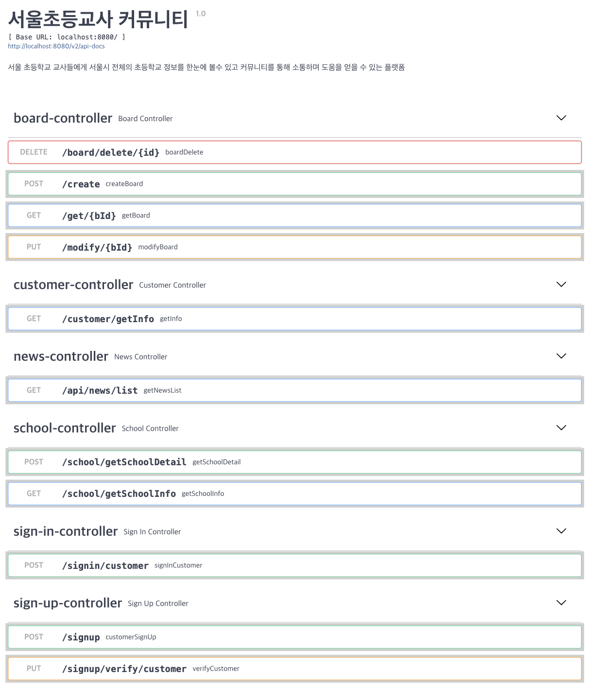
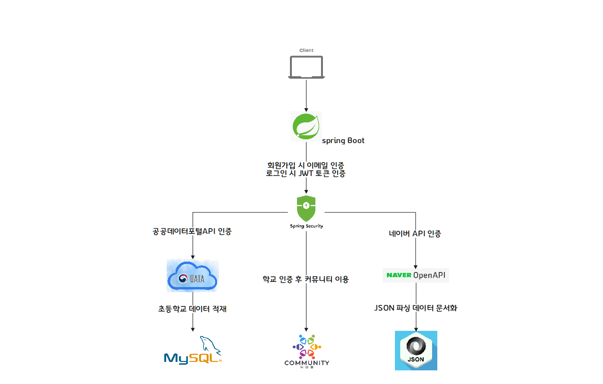
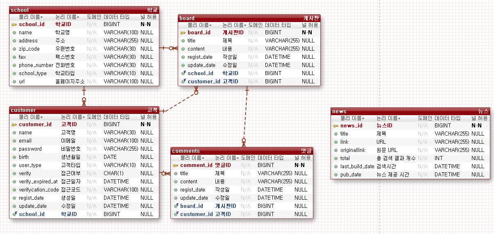

# 🗒 서울 초등학교 교사 커뮤니티

## 프로젝트 기능 및 설계

### USER
    1. 회원가입 기능
     - 회원가입시, 이메일과 비밀번호 정보가 필요하고 이메일은 unique 해야한다.
     - 학교 이메일로 인증을 진행해야 한다.
    2. 로그인
       - 이메일 인증이 된 사용자만 로그인이 가능한다
       - 일치하는 이메일이 없는 경우, 에러가 발생한다.
       - 비밀번호가 일치하지 않으면 에러가 발생한다.
       - 로그인에 성공할 경우, jwt이 발행된다.

### SCHOOL INFO
    1. 서울시 초등학교 정보를 불러온다.
    2. 상세 조건으로 초등학교를 검색할 수 있다.
      - 로그인해서 토큰이 유효한 사용자만 검색이 가능하다.
      - 지역(구 단위)별로 검색이 가능하다.
      - 설립 구분(공립or사립)별로 검색이 가능하다.
    3. 검색된 초등학교의 상세정보를 확인할 수 있다.
      - 도로명 우편번호, 도로명 주소, 상세주소, 전화번호, 홈페이지 주소, 팩스 번호, 개교기념일을 알 수 있다.

### NEWS ABOUT SCHOOL
    1. 초등학교 뉴스 데이터를 한 눈에 볼 수 있다.
       - 로그인해서 토큰이 유효한 사용자만 검색이 가능하다.
       - 초등학교 관련 데이터를 검색하면 조회하여 관련 뉴스를 볼 수 있다.

### COMMUNITY
    1. 게시판의 글은 로그인을 한 User유저만 볼 수 있다.
      - User가 로그인하지 않았다면 에러를 발생한다.
    2. 게시판 글 상세보기에서는 제목, 작성일, 수정일, 작성자, 본문의 내용이 보인다.
    3. 게시판 글 삭제시, 글을 작성한 사람의 계정 비밀번호가 요구된다.
    4. 게시판 글을 작성할 때 제목과 내용을 받아서 저장한다.
    5. 공지사항의 글을 삭제한다.
    6. 사용자 정보를 입력받아 저장하고(이메일, 이름, PW 등) 수정할 수 있게 한다.
    7. (사용자 등록시 이미 있는 이메일은 예외를 발생시킨다.)

## API

## Architecture

## ERD 

### Tech Stack

 
   
   
   
  
   
  
  
  
  

